# 🛍️ Paradise Ecommerce

Paradise Ecommerce is a full-stack Django web application designed to enhance online shopping experiences using personalized recommendations powered by machine learning. Developed as an Information Capture and Dissemination Environment (ICDE) system, it is tailored for real-world e-commerce use cases with modular app structure and cloud-hosted deployment.

---

## 🌐 Live Features Overview

- User authentication and session management
- Browsing and searching through categorized products
- Persistent shopping cart and checkout process
- Recommendation system based on user behavior
- Machine Learning integration for intelligent suggestions
- Amazon Web Services (AWS) cloud deployment
- Clean and scalable Model-View-Controller (MVC) architecture

---

## 📁 Project Structure

```bash
ecommerce/
├── account/       # User login/registration
├── cart/          # Shopping cart logic
├── ecommerce/     # Main project settings
├── payment/       # Payment gateway integration
├── static/        # Static assets
├── store/         # Product listing, filtering, ML hooks
├── db.sqlite3     # Local development DB
├── *.csv          # Data imports & ML datasets
└── manage.py
```

---

## 🖼️ UI Screenshots

### 🔹 Homepage
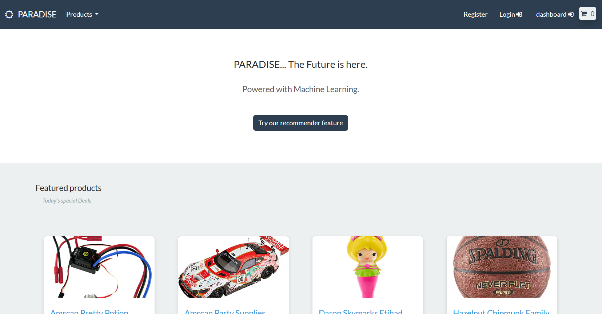

### 🔹 Register Page
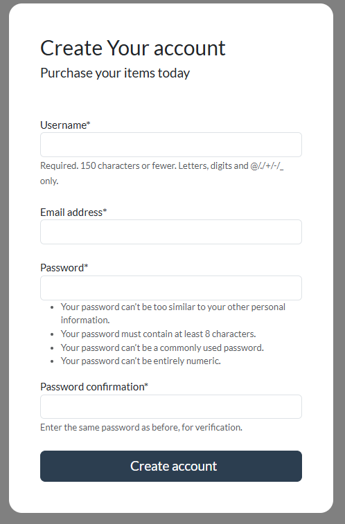

### 🔹 Cart View
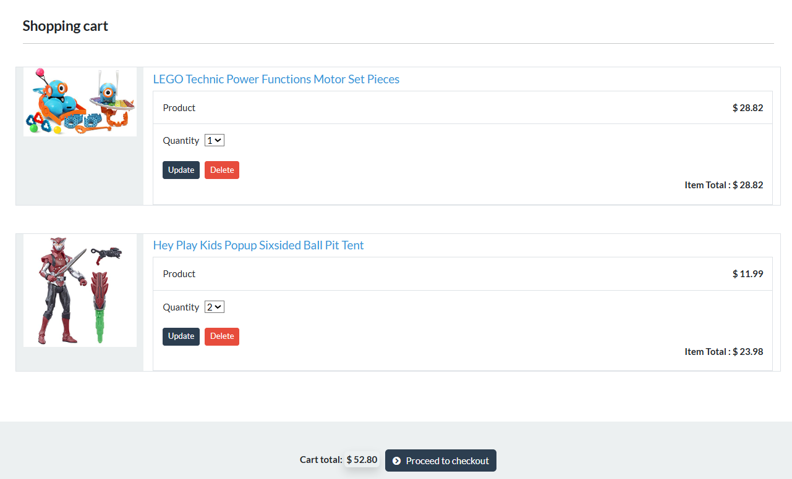

### 🔹 Add to Cart Action
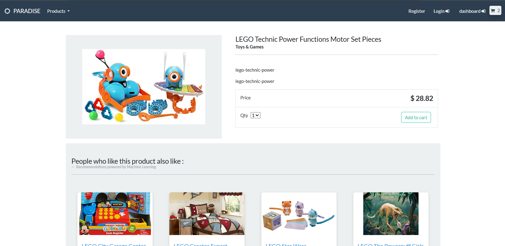

### 🔹 Checkout Page
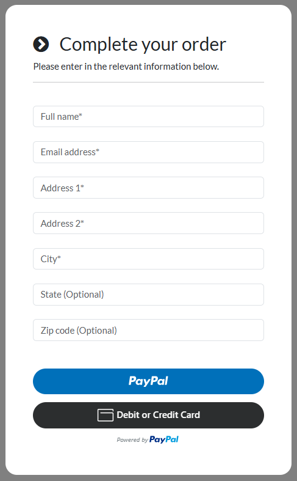

---


## 📊 UML and Architecture

### 🔹 Use Case Diagram
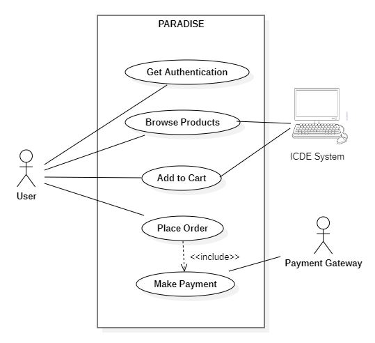

### 🔹 Class Diagram
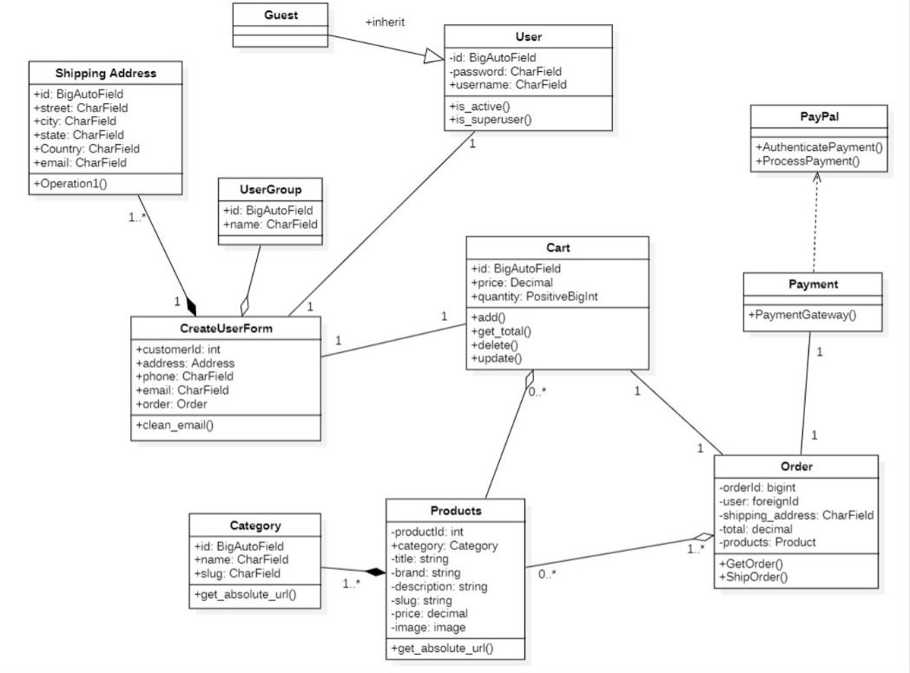

### 🔹 Sequence Diagram
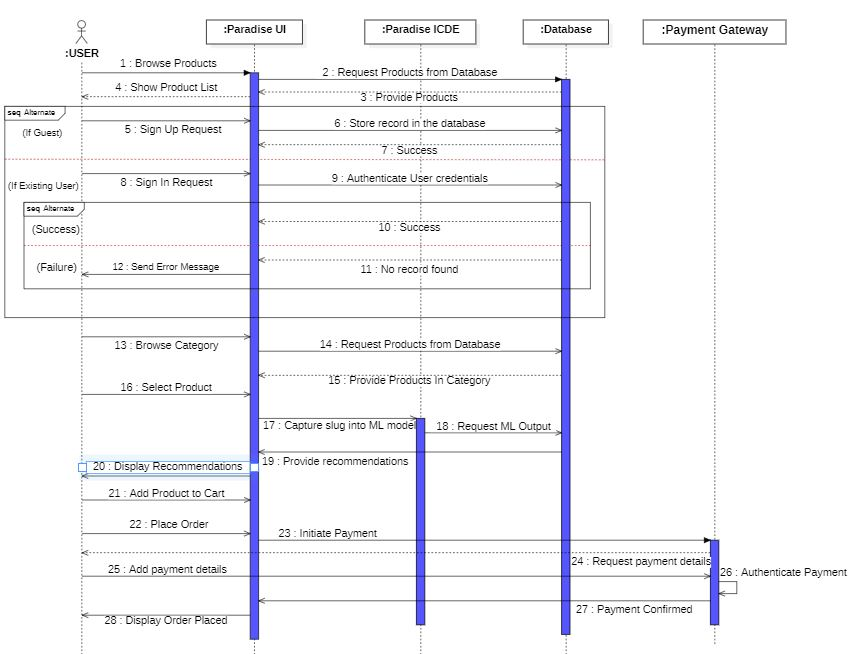

### 🔹 MVC Architecture
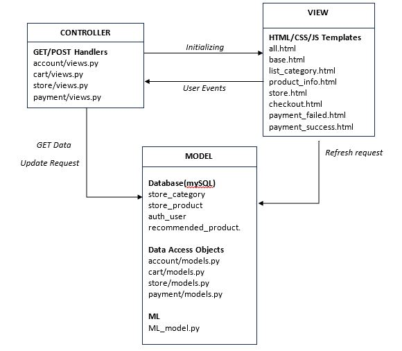

### 🔹 ER Diagram (Database Model)
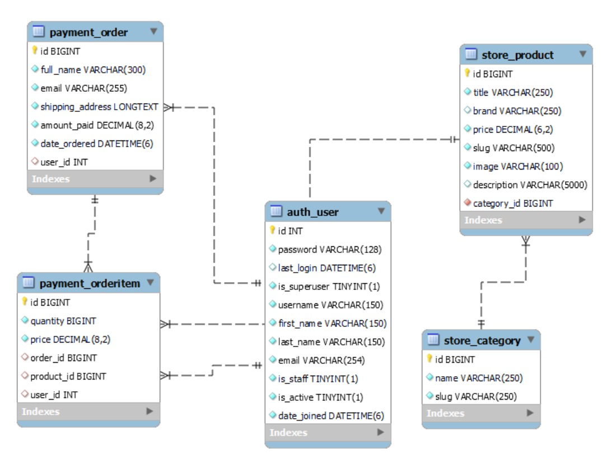

### 🔹 Database Screenshot
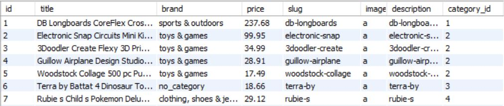

---

## 🧪 User Stories

1. **Authentication** – New users can register or login to access personalized features.  
   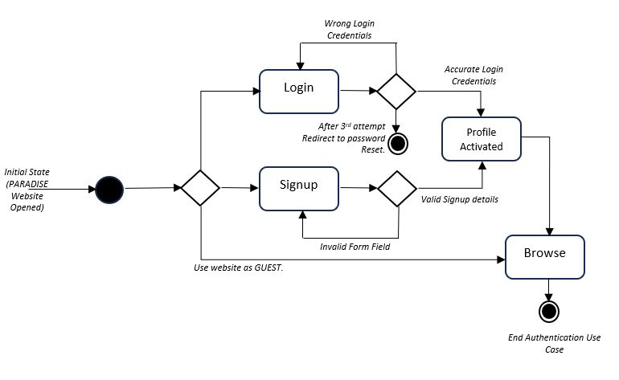
2. **Browsing Products** – Users and guests can search/filter products.
3. **Add to Cart** – Persistent cart for logged-in users; temporary for guests.  
   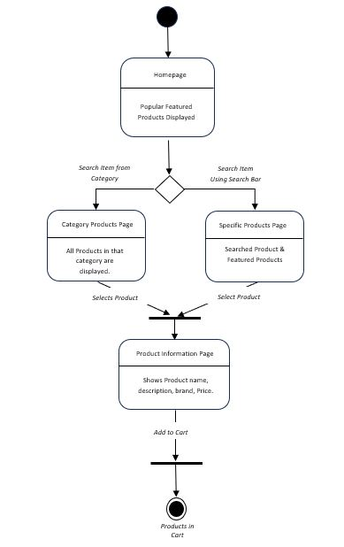
4. **Checkout Process** – Secure payment integration and delivery options.  
   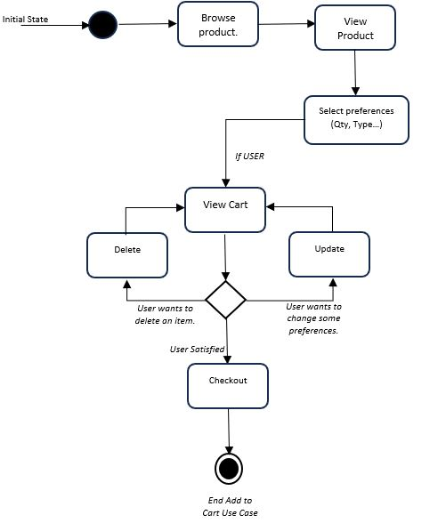

---

## 🛠️ Tech Stack

- **Backend**: Django (Python), Django ORM, SQLite/MySQL
- **Frontend**: HTML, CSS, Bootstrap, JavaScript (Template-based)
- **Machine Learning**: Content-Based Recommendation (trained on Amazon dataset)
- **Cloud**: AWS (EC2, MySQL hosting)
- **Testing**: Unit, Component, and Manual UI testing using Django’s test suite
- **Tools**: Radon for metrics, MySQL Workbench, GitHub CI/CD

---

## 📈 Software Metrics

| Component  | Classes | Functions | LOC | Maintainability |
|------------|---------|-----------|-----|------------------|
| Account    | 4       | 16        | 413 | A (65.95)        |
| Store      | 5       | 9         | 184 | A (100)          |
| Cart       | 2       | 12        | 181 | A (91.61)        |
| Payment    | 5       | 7         | 327 | A (96.03)        |
| Ecommerce  | 0       | 0         | 224 | A (96.61)        |

---

## 🧪 Testing

- **Unit Testing**: Views and models tested using Django's built-in framework.
- **Component Testing**: Checkout, authentication, cart actions tested individually.
- **System Testing**: Performed during final stages with complete integration.

---

## 🚀 Deployment & Hosting

- Hosted on **AWS EC2**
- Database hosted on **AWS MySQL**
- Static files and media served via **Nginx/Gunicorn (optional)**

---

## 📦 Data Source

Machine Learning model trained on:  
- Kaggle Amazon Product Dataset 2020 ([PromptCloud Dataset](https://www.kaggle.com/datasets/promptcloud/amazon-product-dataset-2020))

---

## 📅 Agile Development

- SCRUM Agile Model (3+ sprints)
- Sprint 3 completed core website features
- Sprint 4 focused on ML integration & testing
- JIRA used for issue tracking and burndown chart generation

---


## 🚀 How to Run the Project

### 🧪 Local Deployment

1. **Clone the Repository**
   ```bash
   git clone https://github.com/DeepKondal/Paradise_Ecommerce.git
   cd ecommerce
   ```

2. **Create a Virtual Environment**
   ```bash
   python -m venv venv
   source venv/bin/activate   # For Windows: venv\Scripts\activate
   ```

3. **Install Dependencies**
   ```bash
   pip install -r requirements.txt
   ```

4. **Run Migrations**
   ```bash
   python manage.py migrate
   ```

5. **Start the Development Server**
   ```bash
   python manage.py runserver
   ```

Visit [http://127.0.0.1:8000](http://127.0.0.1:8000) in your browser.

---

### ☁️ Cloud Deployment on AWS (EC2)

1. **Create an AWS EC2 Instance**
   - Choose Ubuntu or Amazon Linux AMI
   - Open ports 22 (SSH), 80 (HTTP), and 8000 (Django dev)
   - Generate and download a `.pem` key pair

2. **SSH into the Instance**
   ```bash
   chmod 400 your-key.pem
   ssh -i "your-key.pem" ec2-user@your-ec2-public-ip
   ```

3. **Install Python, pip, and Git**
   ```bash
   sudo apt update && sudo apt install python3-pip python3-venv git
   ```

4. **Clone the Repository**
   ```bash
   git clone https://github.com/DeepKondal/Paradise_Ecommerce.git
   cd paradise-ecommerce
   ```

5. **Set Up the Virtual Environment**
   ```bash
   python3 -m venv venv
   source venv/bin/activate
   pip install -r requirements.txt
   ```

6. **Run Migrations and Start Server**
   ```bash
   python manage.py migrate
   python manage.py runserver 0.0.0.0:8000
   ```

7. **Access on Browser**  
   Visit `http://<your-ec2-public-ip>:8000`

> ✅ Tip: For production use, configure Gunicorn + Nginx or use Elastic Beanstalk with MySQL RDS.

---


## 👥 Contributors

- Abideep Kondal  
- Adilmanzoor Kalilur Rahman  
- Derrick Narkah  

---

## 📄 License

MIT License © 2025 Team Paradise Ecommerce  
You are free to use and adapt this project **as long as you provide attribution to the original authors.**
